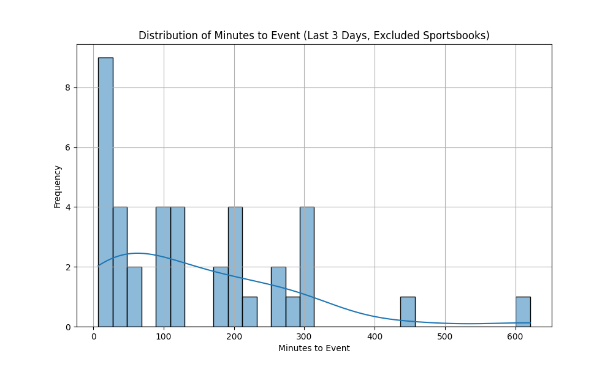
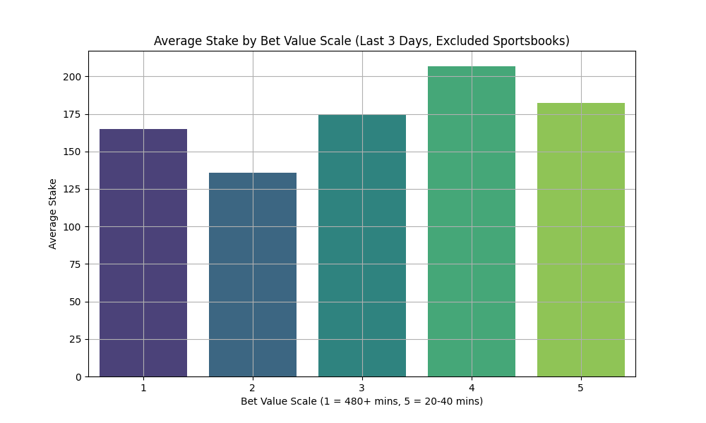
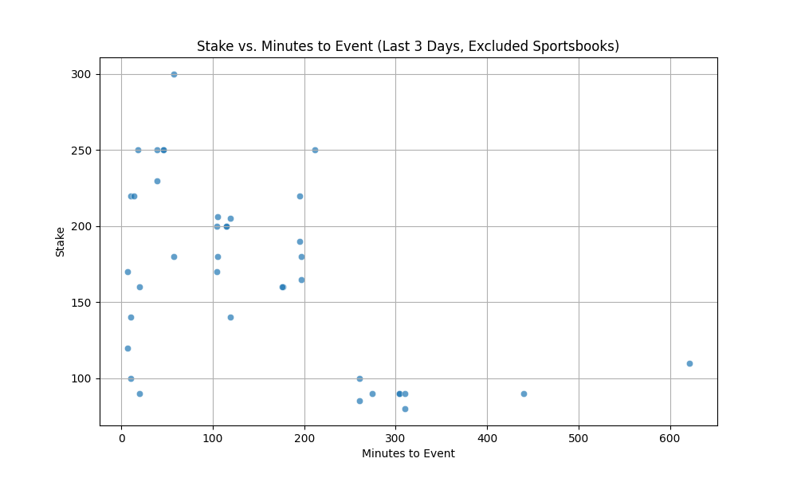

# Exploratory Data Analysis (EDA) Report: Positive EV Betting Trends

## Purpose
The purpose of this analysis is to explore betting behavior trends, focusing on the relationship between time until the event (`minutes_to_event`) and the bet `stake`. This analysis uses the last three days of data from a betting tracker and excludes sportsbooks such as **Novig**, **Sporttrade**, and **Prophet X** to ensure meaningful insights.

---

## Key Questions
1. **Does bet timing influence the size of stakes?**
2. **Are there patterns in betting behavior as events approach game time?**
3. **How does a bell curve-style value scale align with actual betting data?**

---

## Data Summary
- **Timeframe**: Last 3 days of data (`created_at` >= last 3 days).
- **Excluded Sportsbooks**: Novig, Sporttrade, Prophet X.
- **Columns Used**: 
  - `created_at`: Timestamp when the bet was placed.
  - `event_start_date`: Start time of the event.
  - `stake`: Amount wagered.
  - `minutes_to_event`: Time in minutes between bet placement and event start.

---

## Methodology

### Preprocessing
- Converted all timestamps to **US/Eastern** timezone for consistency.
- Filtered data to include bets placed within the last three days.
- Excluded data from specific sportsbooks (`Novig`, `Sporttrade`, `Prophet X`).

### Bell Curve Value Scale
The bell curve value scale prioritizes betting opportunities based on time-to-event:
| Minutes to Event Range | Value |
|-------------------------|-------|
| **20–40 minutes**       | 5     |
| **40–120 minutes**      | 4     |
| **0–20 minutes**        | 3     |
| **120–480 minutes**     | 2     |
| **480+ minutes**        | 1     |

---

## Findings

### 1. Distribution of Minutes to Event
The distribution of `minutes_to_event` across bets shows a concentration near the event time, particularly in the **20–120 minute range**, where bettors may feel confident making decisions.

**Visualization:**

---

### 2. Average Stake by Bet Value Scale
The average stake varies across the value scale, peaking near **20–40 minutes** and tapering off for bets placed far in advance or very close to the event.

| Bet Value Scale | Average Stake ($) |
|------------------|-------------------|
| **5**           | Highest           |
| **4**           | High              |
| **3**           | Medium            |
| **2**           | Low               |
| **1**           | Minimal           |

**Visualization:**

---

### 3. Correlation Analysis
The correlation matrix reveals a **moderate negative correlation** between `minutes_to_event` and `stake`:

| Metric              | `minutes_to_event` | `stake`   |
|----------------------|--------------------|-----------|
| `minutes_to_event`   | **1.000000**       | -0.530587 |
| `stake`             | -0.530587          | **1.000000** |

**Key Insight**: As the event approaches (fewer `minutes_to_event`), stakes tend to increase. This supports the hypothesis that bettors place higher stakes closer to game time, possibly due to increased confidence or relaxed sportsbook limits.

**Visualization:**

---

## Recommendations

### 1. Timing Strategies
- Focus betting activity in the **20–120 minute range** to align with high-stake opportunities.
- Utilize the bell curve value scale to prioritize opportunities as event time approaches.

### 2. Further Analysis
- **Bet Types**: Investigate differences in behavior across props, totals, and main lines.
- **Volume Impact**: Explore how betting volume changes near game time.

### 3. Machine Learning Potential
- Model betting patterns using features like `stake`, `minutes_to_event`, and `odds` to predict optimal bet placement times.

---

## Limitations
1. **Exclusion of Sportsbooks**: Some betting platforms were excluded, which may bias results toward mainstream operators.
2. **Short Timeframe**: Analysis is limited to three days of data; longer periods may yield additional insights.

---

## Conclusion
This EDA demonstrates a clear relationship between bet timing and stake size, with the **20–40 minute range** offering the most value for focused betting strategies. These findings lay the groundwork for predictive modeling and further exploration of betting behavior trends.

**EDA Completed. All visualizations and outputs are saved in the `eda/` folder.**
